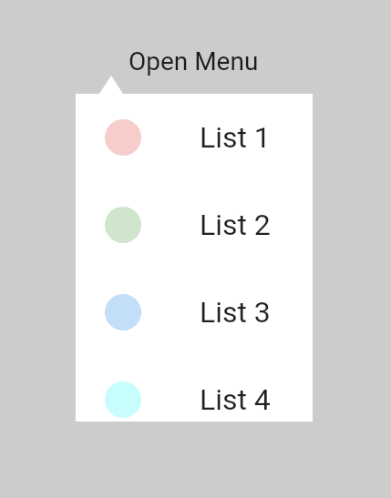

<!-- 
This README describes the package. If you publish this package to pub.dev,
this README's contents appear on the landing page for your package.

For information about how to write a good package README, see the guide for
[writing package pages](https://dart.dev/guides/libraries/writing-package-pages). 

For general information about developing packages, see the Dart guide for
[creating packages](https://dart.dev/guides/libraries/create-library-packages)
and the Flutter guide for
[developing packages and plugins](https://flutter.dev/developing-packages). 
-->

FlutterPopupMenuButton is a widget used for a customizable popup menu button.

## Features
```html

<p>
FlutterPopupMenuButton provides you a complete customizable popup menu button.
In this package you have control of almost each and every thing like where to show the menu.
It has <b>MenuDirection</b> enum to set your menu direction.
</p>
```

```dart
enum MenuDirection{
  left,
  right,
  top,
  bottom,
  center,
  none
}
```

```html
You can even draw custom shape for your menu using <b>CustomPainter class and provide painter to named parameter customPainter in FlutterPopupMenuButton widget</b>.  
<b>Image Example</b>

```

## Getting started
Just add dependency to your pubspec.yaml and you start using the package.

```yaml
dependencies:
    flutter:
        sdk: flutter

        flutter_popup_menu_button:
```

```dart
class MyApp extends StatelessWidget {
  const MyApp({Key? key}) : super(key: key);

  @override
  Widget build(BuildContext context) {
    return MaterialApp(
      debugShowCheckedModeBanner: false,
      home: SafeArea(
        child: Scaffold(
          body: Align(
            alignment: Alignment.topLeft,
            child: FlutterPopupMenuButton(
              direction: MenuDirection.right,
              decoration: const BoxDecoration(
                  borderRadius: BorderRadius.all(Radius.circular(20)),
                  color: Colors.white
              ),
              popupMenuSize: const Size(160,200),
              child: FlutterPopupMenuIcon(
                key: GlobalKey(),
                child: Icon(Icons.more_vert),
              ),
              children: [
                FlutterPopupMenuItem(
                    closeOnItemClick: false,
                    child: ListTile(
                      title: const Text('List 1'),
                      leading: Container(
                        height: 20,
                        width: 20,
                        decoration: BoxDecoration(
                            color: Colors.redAccent.withOpacity(0.3),
                            shape: BoxShape.circle
                        ),
                      ),
                    )),
                FlutterPopupMenuItem(
                    closeOnItemClick: false,
                    child: ListTile(
                      title: const Text('List 2'),
                      leading: Container(
                        height: 20,
                        width: 20,
                        decoration: BoxDecoration(
                            color: Colors.green.withOpacity(0.3),
                            shape: BoxShape.circle
                        ),
                      ),
                    )),
                FlutterPopupMenuItem(
                    child: ListTile(
                      title: const Text('List 3'),
                      leading: Container(
                        height: 20,
                        width: 20,
                        decoration: BoxDecoration(
                            color: Colors.blue.withOpacity(0.3),
                            shape: BoxShape.circle
                        ),
                      ),
                    )),
                FlutterPopupMenuItem(
                    child: ListTile(
                      title: const Text('List 4'),
                      leading: Container(
                        height: 20,
                        width: 20,
                        decoration: BoxDecoration(
                            color: Colors.cyanAccent.withOpacity(0.3),
                            shape: BoxShape.circle
                        ),
                      ),
                    ))
              ],
            ),
          ),
        ),
      ),
    );
  }


}
```

